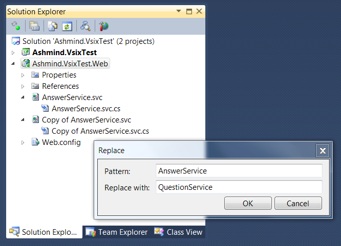

### Overview

CopyAndReplace is a Visual Studio extension that gives you a change to rename and replace in files you have just copy/pasted.
The basic idea is that sometimes it is much easier to start with a similar class and reduce/change it than to start with a blank file.

*Visual Studio Gallery link coming soon.*

### Q&A

  1. ####What are some example use cases for this?

     Let's say you have a `Request`/`Response`/`Handler` architecture: you have `QuestionRequest`, `QuestionResponse` and `QuestionHandler`.
     `QuestionHandler` may look like this:
        
        public class QuestionHandler : Handler<QuestionRequest, QuestionResponse> {
            public override QuestionResponse ProcessRequest(QuestionRequest request) { ... }
        }
     Now you want to add same things for `Answer`.  
     Obviously, logic will be different, but the structure is similar (including namespace imports).  

     CopyAndReplace allows you to use existing `Question` classes as an ad-hoc template: just copy/paste them and choose to rename `Question` -> `Answer`.
     Moreover,  it will be smart enough to replace `question` to `answer`.

     Another example might be copying `.svc` and getting replacement in both code and `<%@ ServiceHost %>` directive.

  2. ####How do I invoke this extension?

     Just copy/paste some files. If nothing happens, please file an issue and include log from `Output Window -> Show output from: ->  CopyAndReplace (Diagnostic)`.

  3. ####How does smart casing work?

     Currently, if you enter `OldClass` -> `NewClass` in the replacement dialog, the following replacements can actually take place:
     
    | Original   | Replacement |
    |------------|-------------|
    | `OldClass` | `NewClass`  |
    | `oldClass` | `newClass`  |
    | `OLDCLASS` | `NEWCLASS`  |
    | `oldclass` | `newclass`  |
     
     Both source and replacement can include `_`, `.`, etc — this is ignored and left as is by smart casing.

  4. ####Does the replacement parse source code?

    No. CopyAndReplace just does a simple text-based replace (aside from smart casing).
    However, given that the file being changed is a new copy, there is no need to do any refactoring.

### Future plans

Not really planning anything, please file any bugs/enhancement through Issues.
